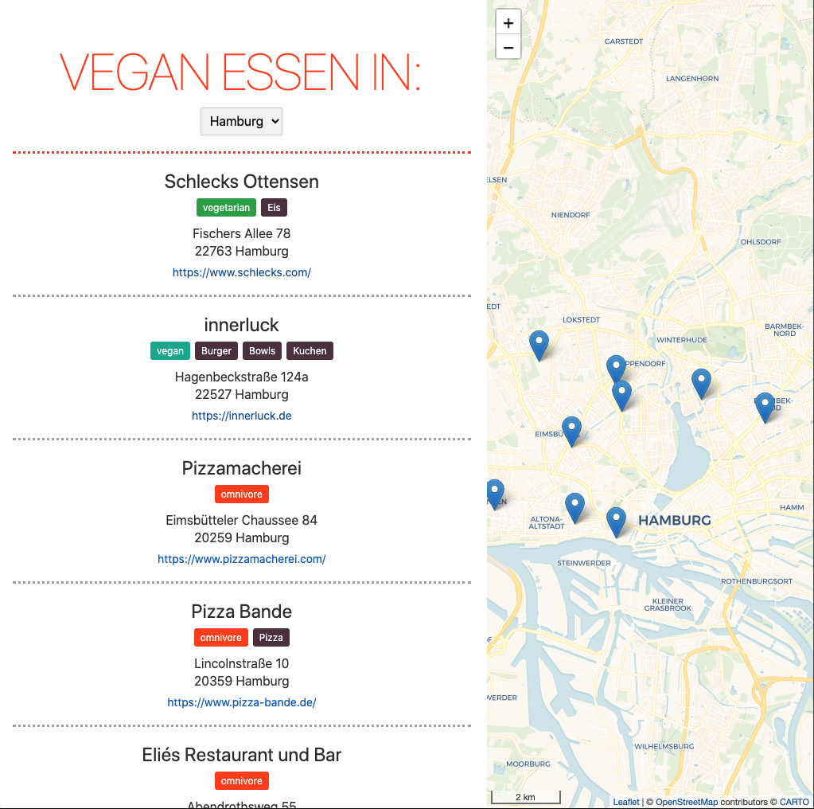

# Find a vegan restaurant near you - With the help of Svelte! 🌱

Trying out Svelte was on my bucket list of months or maybe even for years.
When I was thinking about vegan restaurants in my hometown I finally found 
a suitable use case 🍔🍟🍕
I wanted to show my favourite locations on a map.
That way I can remember where I've been and which restaurants I still want to go to. 
I also wanted to display information such as the address or excerpts from the menu in a list.

## Implementation

To store and provide the data about the restaurants, I use the content management system *Contentful*. 
In my current client project, I already work with another CMS, but I find Contentful very suitable for managing the restaurants.
In particular, the Google Maps function integrated into Contentful was very helpful.
With it, I can search for a restaurant and save the coordinates determined by Google Maps in the CMS.
With a GET request, I can then retrieve the coordinates together with other restaurant data and use them in the frontend 🗺

I created the Svelte project with degit according to these [instructions](https://svelte.dev/blog/svelte-for-new-developers).
In addition, I use TypeScript and [SCSS](https://linguinecode.com/post/add-sass-svelte-js), which can be configured subsequently with little effort.
The application itself consists mainly of a GET request to Contentful to read the restaurant data.
I use Leaflet to display the map. 
Now when I publish new restaurants in Contentful, they are visible in the frontend after a few seconds. 

The application was [deployed](https://vgnmap.netlify.app/) on Netlify.
A push on the main branch in Github starts the build process on Netlify, where the latest version of the project is then delivered:

## Future improvements

In the future I may want to add and display more information about the restaurants.
For example, I am thinking of photos, ratings and opening hours.
So far, there are also only a few restaurants in Hamburg, Berlin and Munich. But other cities will surely follow.

And I quickly finished the project in my spare time between Christmas and New Year 🙈
The code base should therefore still be tidied up and the city coordinates need to be removed from the code.
But before I start, I should definitely write a few tests...
